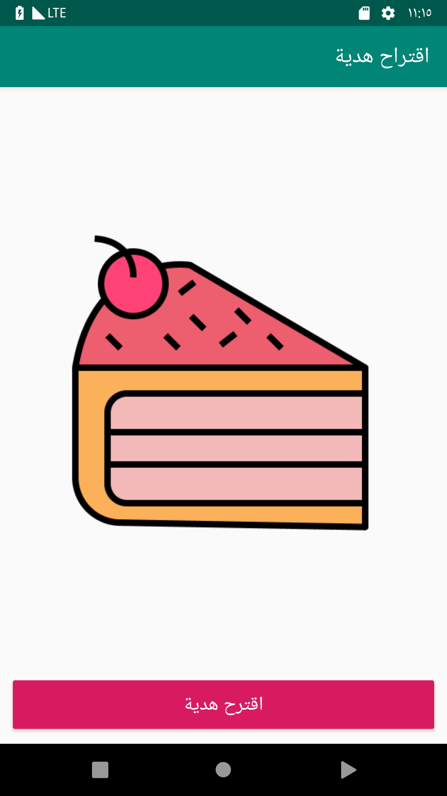
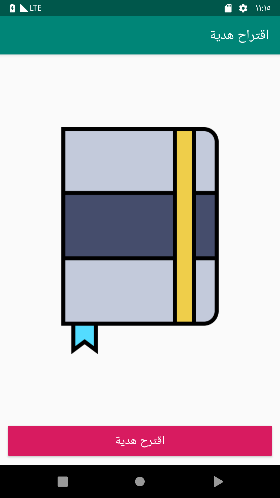

# Gift Suggestion App (Phase 1)

This is the repository for the gift suggestion app that students build during [the Android Degree at Barmej.com](https://www.barmej.com/degree/android)

This app is a simple Android app that allows users to get random gift suggestion form a set of predefined gifts. This app uses the [Random](https://docs.oracle.com/javase/8/docs/api/java/util/Random.html) java class to generate a random number and then use that generated number to select a random gift from a predefined array of gifts and then show that gift to the user.

To use this repository, fork/clone it, or download a zip using the green "Clone or download" button at the top of the file list. Each branch correspond a video lesson in the course.

# Screenshots
   

# Contributing
All contributions are welcome and gratefully accepted.

# License

A copy of the license is also available in the [license file](LICENSE).

# Demo

